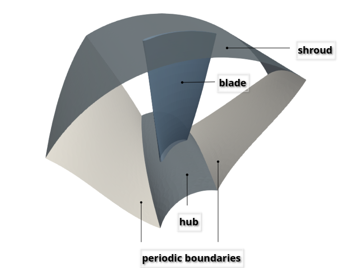
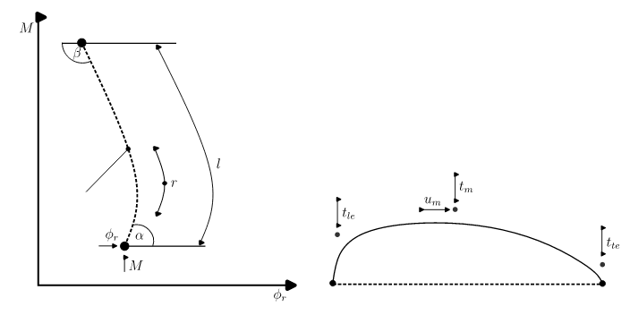

# Axial turbine dataset

An axial turbine is a simplest hydrulic machine which is suitable for low-head conditions. It is required to simulate a machine through CFD and post-process the results to compare the performances of different machines. However, performing CFD simulations are computationally time-consuming and expensive. The goal of this repository is to provide the database of axial turbines and their corresponding post-processed results.

This repository contains the complete dataset and the associated analysis scripts used in our research on optimizing axial turbines. The optimization was performed using a Genetic Algorithm and parallelization via the island model. For a more comprehensive explanation of the optmization process, including the parameterization of the turbine and detailed methodology, can be found in [PAMM 2024 paper](https://onlinelibrary.wiley.com/doi/10.1002/pamm.202400126) [1]. 

---
### Axial turbine

A section of an axial turbine and its corresponding blade parameterization in shown here.

<p align="center">
  
   
</p>

The upper and lower bounds of different parameters are given in the appendix of [PAMM paper](https://onlinelibrary.wiley.com/doi/full/10.1002/pamm.202400104) [2]. The CFD simulation was performed using OpenFOAM (version 2023) [3]. The flow field simulation results were ommitted due to their large size.

---
### Dataset description

This dataset originates from turbine optimization simulations and is stored in a series of text files. Each file captures specific attributes for 1,000 unique turbine blade designs, with each design evaluated at three different operational points: part load (tl, German: Teillast), nominal load (n), and full load (vl, German: Volllast).  In total, 21,281 individuals (turbines) were computed. Each individual in the dataset represents a distinct turbine blade geometry, optimized across these operational conditions.

The dataset includes the following key parameters:

Key Parameters (Objectives of the Optimization):

    - eta (η): Efficiency, normalized between 0 and 1, indicating the performance of the turbine.
    - VCav: Cavitation volume, measured in cubic meters (m³), reflecting the extent of cavitation in the turbine.
    - dH (ΔH): Difference in the design head between the desired and computed value, measured in meters (m).

For each individual, these parameters are provided at three operational points:

    - tl: Part load (Teillast).
    - n: Nominal load.
    - vl: Full load (Volllast).
    
Fitness Evaluation:

The fitness of each individual is calculated based on three key metrics:

    - The average efficiency across the three operational points.
        - 1−mean(η[′tl′],η[′n′],η[′vl′])
    - The average cavitation volume across the operational points.
        - mean(VCav[′tl′],VCav[′n′],VCav[′vl′])
    - The average deviation in the design head across the operational points.
        - mean(dH[′tl′],dH[′n′],dH[′vl′])
    
Design Parameters (Inputs):

The design parameters describe the geometry of the turbine blade and were originally referred to as "objectives." However, to better align with machine learning practices, we rename these parameters during the data loading process the to "input". These inputs, stored in `data['input']`, correspond to specific geometric features of the turbine blade. The labels of these parameters are provided in the variable parameter_labels.
    - The input data contains 30 design parameters for each individual, describing the geometry of the turbine blades.

---
### Tutorial Jupyter Notebook

The Jupyter [data_handling.ipynb](https://github.com/ihs-ustutt/axial_turbine_database/blob/main/data_handling.ipynb) serves as a tutorial on how to read, load, and manage the dataset stored in text files within the [runData](https://github.com/ihs-ustutt/axial_turbine_database/tree/main/runData) directory. The notebook primarily relies on commonly used Python libraries. All necessary packages for the Python environment are listed in the [requirements.txt](https://github.com/ihs-ustutt/axial_turbine_database/blob/main/requirements.txt) file.

Additionally, the Pygmo library is utilized for advanced optimization tasks, specifically the [fast non-dominated sorting algorithm](https://esa.github.io/pygmo2/mo_utils.html) to generate the Pareto front. This is essential for selecting non-dominated individuals during the optimization process, specifically for recombination and mutation within the NSGA-II algorithm. The Pygmo library is only required if this advanced functionality is needed.

### Visualization

It is possible to visualize the axial turbines with the design tool [dtOO](https://ihs-ustutt.github.io/dtOO/quickstart.html). Standalone direct visualization is not possible. The faster way to import `dtOO` is to use the [docker container](https://ihs-ustutt.github.io/dtOO/quickstart.html).

---
### Dataset extension

It is very much possible to extend the dataset. A [docker container](https://ihs-ustutt.github.io/dtOO/quickstart.html) containing all pre-requisites is made available. However, an extension of the dataset comes at a computational cost as CFD simulations need to be performed, followed by post-processing. It is the user's choice whether to save or omit the flow field results based on the requirements.

---
### License

This database is licensed under the [MIT license](/LICENSE). Feel free to use all or portions for your research or related projects so long as you provide the following citation information:

```bibtex

@article{Rentschler2024,
  title = {Multi‐criteria hydraulic turbine optimization using a genetic algorithm and trust‐region postprocessing},
  ISSN = {1617-7061},
  url = {http://dx.doi.org/10.1002/pamm.202400126},
  DOI = {10.1002/pamm.202400126},
  journal = {PAMM},
  publisher = {Wiley},
  author = {Rentschler,  Tobias and Berkemeier,  Manuel Bastian and Fraas,  Stefan and Tismer,  Alexander and Raj,  Rohit and Peitz,  Sebastian and Riedelbauch,  Stefan},
  year = {2024},
  month = oct 
  }
```
---
### Acknowledgement

This work was funded by the German Research Foundation (DFG) under the special priority program SPP-2353 (Grant number: 501932169).

---
### References

1. Rentschler, T.; Berkemeier, M. B.; Fraas, S.; Tismer, A.; Raj, R.; Peitz, S.; Riedelbauch, S.: Multi-criteria hydraulic turbine optimization using a genetic algorithm and trust-region postprocessing. Proceedings in Applied Mathematics and Mechanics, e202400126, 2024. [DOI: 10.1002/pamm.202400126](https://doi.org/10.1002/pamm.202400126) 
2. Raj, R.; Tismer, A.; Gaisser, L.; Riedelbauch, S.: A deep learning approach to calculate elementary effects of morris sensitivity analysis. Proceedings in Applied Mathematics and Mechanics, e202400104, 2024. [DOI: 10.1002/pamm.202400104](https://doi.org/10.1002/pamm.202400104)
3. Jasak, H.; Jemcov, A.; Tukovic, Z.: [OpenFOAM: A C++ library for complex physics simulations. In International workshop on coupled methods in numerical dynamics](https://www.researchgate.net/publication/228879492_OpenFOAM_A_C_library_for_complex_physics_simulations), 2007 Sep 19,Vol. 1000, pp. 1-20.
